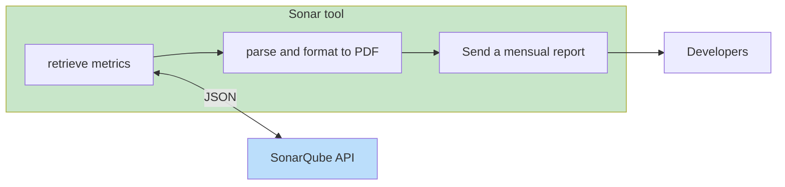

## Sonar tool
This project aim to fetch each project metrics from SonarQube,  generate a PDF report and send this report each Mounth by email and teams webHook

## Architecture

```mermaid
flowchart LR
 subgraph s1["Sonar tool"]
        parseandformat["parse and format to PDF"]
        retrivemetrics["retrieve metrics"]
        notification["Send a mensual report"]
  end
    retrivemetrics <-- JSON --> sonarQube["SonarQube API"]
    retrivemetrics --> parseandformat
    parseandformat --> notification
    notification --> developper["Developers"]

    style sonarQube fill:#BBDEFB
    style s1 fill:#C8E6C9
```
